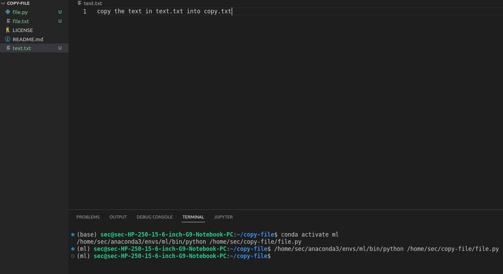

# copy-file
## AIM:
To write a python program for copying the contents from one file to another file.
## EQUIPEMENT'S REQUIRED: 
PC
Anaconda - Python 3.7
## ALGORITHM: 
### Step 1:

Start the program
### Step 2:

Open file1.txt in read mode
### Step 3:

aasign paar to fp.read() of file1.txt
### Step 4:

again open a new file file2.txt in write mode
### Step 5:

use write function to copy the file contents
### Step 6:

End the program
## PROGRAM:
```

with open ("text.txt") as fp:
  with open("file.txt","w") as fp1:
    line= fp.read()
    fp1.write(line)
```

### OUTPUT:



## RESULT:
Thus the program is written to copy the contents from one file to another file.